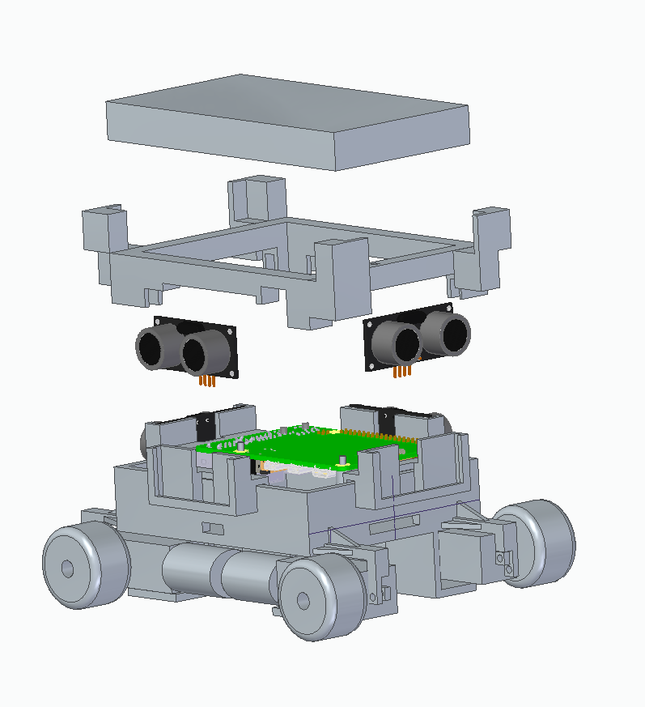
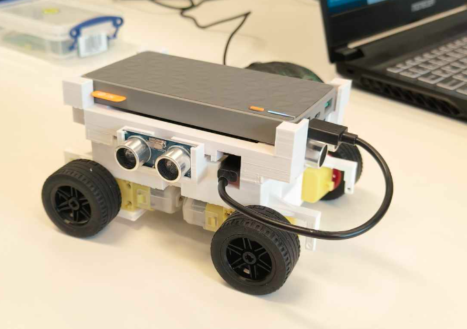

# Maze Mapping Robot

  This contains all the code necessary to run the maze solving robot we designed. The robot makes use of 3 (or 4 depending on the initial conditions of the robot) ultrasonic distance sensors, 4 dc motors, a 6DOF module, and a raspberry pi. The chassis was 3d printed. The robot maps the maze into a internal graph data structure which is contained in a mapping library which paths through the maze using a DFS. The module design uses a simplified API can behavior can be easily adapted without much experience with the codebase. Furthermore the robot can communicate with a windows application to visualize and control it via a GUI.
  

# Modules

*   robot.py: This module provides an interface to the physical robot, allowing you to control it via simple functions without having to repeatedly control motors and sensors directly.

*   Libs.py: This contains libraries (mainly the gyroscope library that controls the gyroscope's behavior and interface)

*   maze\_graph.py This contains the data structure that is internally used to map out and define the maze.

*   mapper.py: This contains the mapping logic that determines how the robot will approach mapping out the maze.

*   core.py: This is the main module which defines what the robot's behavior and instantiates all necessary library objects.

*   api\_manager.py: This contains a simplified interface to interact with the database api.